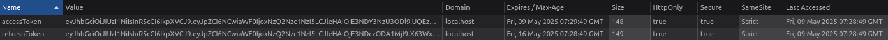

# Report

- Full Name: Van Gompel Thomas
- Student Number: R0942966
- Full Name of person you made your full stack project with: Harold Frenay
- Student Number of person you made your full stack project with: r1001772
- Brief description of your project and the technologies used for front- and back-end:

## Description

We made a budget application, where you can track your expenses and income. There i also a possibilty of sharing a wallet with other users for events or group activities etc. We also made a subscription option for income or expenses.

## Front-End Tools and Technologies

- Next.js
- React
- TypeScript
- Tailwind CSS
- Bootstrap
- SWR
- React Datepicker
- i18next

## Back-End Tools and Technologies

- Node.js
- Express.js
- Prisma
- PostgreSQL
- Helmet
- Swagger
- Jest
- Dotenv

## Database and ORM

- Prisma Schema
- PostgreSQL

## Testing and Configuration

- Jest
- Prettier
- TypeScript Config (tsconfig.json)

# Cryptography

## Before

There is no cryptography. We did not finish our project at all so we didn't get to this point.

## After

I didn't really have any security measures so this is what i added:

- JWT
  - Tokes validated using middleware, so routers are protected and they have input validation.
  - Secrets generated and stored in AWS. Tokens ahve expiration and invlaid tokes are blocked.
  - Refresh handling and authentication.
- Passwords
  - passwords are hased and salted using bcrypt.
- Secrets
  - Secrets are stored in my .env file
- Input validation
  - Input validation to prevent injection

## Code Examples

- user.routes.ts -> 130 uses JWT middleware to validate tokens along with input validation
- subscription.routes.ts -> 78 uses JWT middleware to validate tokens along with input validation
- transaction.routes.ts -> 228 uses JWT middleware to validate tokens along with input validation
- key_management.py: strong secret generation and storage in AWS, JWT toke creation, expiration, validation and protection against invalid or expired tokens.
- .env: secrets
- jwt.ts: JWT function implementations
- auth.ts: JWT middleware that verifies tokens, and restrics acces to protected routes.
- auth.routes.ts: JWT athentication with token generation, refrash handeling, input valitdation and password hashing
- user.service.ts -> 40: used bcrypt to (salted) hash passwords

# Injections

## Before

We used prisma, and this uses parameterized queries. This means sql injection attacks are already mitigated.

## After

- kept in your project
  - parameterized queries
  - no JSON.parse, this could lead to NoSQL injection
- changed in your project
- prevent sql injection
  - using zod to validate input in my api routes.
  - Don't give privilages to users in the database.
- prevent XSS
  - sanitizing and encoding the user generated content, backend and frontend
  - use a cps header
- Secure cookies
- Encrypt Data in Transit

## Code Examples

- zod validation
  - Done in all routes.ts
  - example: auth.routes.ts -> 10 & 15
- least privilages

  - Queries are in .env (commented) -> 7-18

- sanitzing user generated content
  - done in all the index.tsx files
    - example: LoginForm.tsx -> 83
  - done in all routes.ts files
    - example: auth.routes.ts -> 55 & 103
- cps header: app.ts -> 21

- secure cookies: auth.routes.ts -> 72

# Class 04 Vulnerable & Outdated components

## SBOM & Dependency Check

- install Syft
- install dependencies on both back and frontend.
- generate sbom: syft dir:. -o cyclonedx-json > sbom.json

- download dependency track
- run it locally and login
- create project
  - upload sbom
  - check the vulnerability audit for possible weaknesses

## Vulnerabilities

- vulnerabilities:
  - high: CVE-2022-25883 (NVD) -> weakness: CWE-1333: Inefficient Regular Expression Complexity
  - medium: CVE-2024-10491 (NVD) -> weakness: Resource Injection
  - medium: CVE-2024-6484 (NVD) -> weakness: CWE-79: Improper Neutralization of Input During Web Page Generation ('Cross-site Scripting')

npm audit gives me 8 vulnerabilities while dependecny-track only gives me 4.

## Vulnerabilities - Updated

- mitigated:

  - CVE-2022-25883 (NVD), upgraded semver to 7.5.2 via updating react scripts. This was a high risk, and there is an upgrade available.

- kept:

  - CVE-2024-10491 (NVD), because there is limited exposure in the code. There is also no patch from the developer.
  - CVE-2024-6484 (NVD), because the risks are mitigated through input validation.

# Class 05/06/07 - Authentication, Session Management & Authorization

(guideline: max 2 A4 pages, images/code snippets not counted)
Describe each of the following functionalities in your application AS IS:

- user registration & user removal

  - registration:

    - input validation: The input is validated using zod
    - Password hashing: Password are beiing hashed with bcrypt before storing in the database.
    - Role validation: Restricts the role field to specific fields (admin | owner | user) with zod.
    - error handling: The api provides clear error messages when someting goes wrong, but avoids exposing sensitive data.

  - user removal
    - Authentication: The JWT middleware ensure only authenticated users can access protected routes.
    - Input validation: Input is validated to ensure malicious or invalid input is prevented.
    - Error handling: Propper error handling to ensure that no sensitive data is leaked.

//
Summary of Improvements
User Registration
Restrict role assignment to prevent users from registering as admin.
Implement email verification to ensure ownership of the email address.
Enforce stronger password policies (e.g., disallow common passwords).
Log registration attempts for auditing.
Apply rate limiting per IP address.
Add CSRF protection for the /register route.
User Removal
Implement soft deletes to allow recovery of deleted users.
Log user deletion attempts for auditing.
Add a confirmation mechanism before deleting a user.
Apply rate limiting to the DELETE /users/:id route.
Prevent admins from deleting their own accounts.
Add CSRF protection for the DELETE /users/:id route.
//

- user authentication

  - JWT authentication

    - JWTs are used for stateless authentication.
    - Tokens are signed using a secret key, to ensure their integrity.

  - Token refresh mechanism

    - Refresh tokens are used so new JWT tokens can be assigned to users without them logging back in.
    - The old token is revoked when a new one is made.

  - HTTP-only cookies

    - Tokens are stored in cookies, this reduces the risk of XSS attacks (inaccessable to JavaScript)

  - Input validation
  - Password hasing

- password forgotten
  - This is not currently implemented.
- change password

  - This is not currently implemented.

- session management (Stateful or Stateless, how session information is being created, stored and transferred, where do you access it, where do you verify it, how do you terminate it, ...). Also include screenshot(s) of the whole cookie/token/header (so I can clearly see all properties and the value).

- Session type

  - Stateless: My application does not store it on a sever, session data is encoded in a JWT token.
    - the JWT token contains the user information and signed with a secret key.
    - The client includes the token when he makes a request to a protected route for his authentication.
    - The server validates the token on each request without needing to maintain session state.

- Session creation

  - A session is created during the login phase.
  - how?
    - After validating the users credentials, a JWT and refresh token are created.
    - The tokens are sent to the client and stored in HTTP-only cookies

- Session storage

  - They are stored in HTTP-only cookies, mitigating XSS attacks
  - Secure: Cookies are marked as secure so they are only sent over HTTPS
  - SameSite: Cookies are marked as SameSite=Strict, reducing the risk of CSRF attacks

- Session transfer

  - The client includes the token with every request in the authorization header.

- Session access

  - The JWT token is extracted from the authorization header.
  - The verifyToken function validates the token en decodes the payload.
  - The decoded user information is attached to an object for use in the router handlers

- Session verification

  - The middleware verifies the token every time a request is made
  - How?
    - The verifyToken function checks the tokens signature and expiration
    - If the token is valid the request may proceed, otherwise a 401 UnAuthorized reponse is returned.

- Session termination

  - JWT expiry: the token automatically terminates when the token is expired (15 minutes)
  - Refresh token revocation:
    - When a refresh token is issued, the old token is revoked.
    - Revoked token are blacklisted to prevent reuse.
  - Logout: The client can terminate the session by clearing the cookies containing the tokens

- access control (what roles, permissions, ... do you have and how and where do you check them, but also do you enable CORS and/or CSP and/or CSRF and how did you configure it)

- Roles and permissions

  - Roles

    - Admin
      - Can delete users
      - Can update user roles
    - Owner
      - No current use in the application
    - user
      - Can access their own resources

  - Permissions
    - Permissions are enforced based on the users role, which is included in the JWT payload.
    - Where?
      - JWT middleware (authenticaion): Validates the JWT and attaches the users id and role to the req object.
        - Routes check the users id to make sure they can only access their own resources.
      - Admin-only middleware (authorization): Ensure only users with the admin role can access certain routes.

//What Needs Improvement
CSP:
Implement a Content Security Policy to restrict the sources of scripts, styles, and other resources.
CSRF Protection:
Add CSRF tokens to protect routes that modify data.
Audit Logging:
Log access to sensitive routes (e.g., user deletions, role updates) for monitoring and auditing.
CORS Wildcards:
Ensure that wildcard origins (\*) are not used in production.

### improvements

- user registration

  - rate limiting
  - stronger passwords needed

- user removal:
  - Authorization: User removal should only be done by admins

For the functionalities you did not have yet, implement them. Or if not feasible, describe how you would implement them but why it's not feasible for you. When evaluating this, based on what we saw in class, did you improve your functionalities or code? If so, please explain what you changed and why.

How did you test/check for vulnerabilities?
Were you able to perform any kind of session attack or access control on your application?

# Class 08 - Secure CI/CD & Supply Chain

## Project for this course

To what phase in the CI/CD cycle did your application go and what threats could you possibly identify (categorize per SLSA item)?
Were you able to mitigate one of them?
If yes, explain how you did it.
If not, why was it impossible to mitigate?

## Project for the SE course

Did you follow the SE topic already or are you following it in parallel? If yes, can you identify possible threats in that project?
Were you able to mitigate one of them?
If yes, explain how you did it.
If not, why was it impossible to mitigate?

# Class 09 SSRF

Does your application process user controlled URL's? If yes, would an SSRF attack be possible? Were you able to mitigate this risk, and how? (max. 10 lines)

# Class 09 Logging & Monitoring

Evaluate the 7 sacred rules against your application. What logging framework do you use or did you implement on top?
Can you provide me with a valuable snippet of the logging for a 5 minute use of the application?

(max. 10 lines + print screen of log)

# Class 09 SAST

What SAST Tool did you install in your IDE?

What errors did you get (copy paste the basic error messages)?

What errors were you able to fix, and how? (max 3 lines per fix)

# Class 09 DAST

Launch ZAP egainst your application. First not authenticated, then in a second scan being authenticated.

Export each result to a report and add to appendix.

What errors were you able to fix, and how? (max 3 lines per fix)

# Class 10 topic

# Conclusion

Write a conclusion (most important thing you changed and learned) and identify at least one example (per security principle) of how you implemented the security principles.

# Appendix

## Tools used

Mention here all the tools/libraries you used for improving the security.
Provide me below with both pentest reports from ZAP:

### ZAP Test (non authenticated)

### ZAP Test (authenticated)

## Vulnerabilities discovered

NVD CVE-2025-0001 17 Feb 2025 - 0
NVD CVE-2025-0014 2 Apr 2025 - 0
NVD CVE-2025-0015 3 Feb 2025 - 0
NVD CVE-2025-0049 28 Apr 2025 - 0
NVD CVE-2025-0050 7 Apr 2025 - 0
NVD CVE-2025-0053 14 Jan 2025 CWE-209 0
NVD CVE-2025-0054 11 Feb 2025 CWE-79 0
NVD CVE-2025-0055 14 Jan 2025 CWE-497 0
NVD CVE-2025-0056 14 Jan 2025 CWE-497 0
NVD CVE-2025-0057

### SBOM

Put here your SBOM file.

## Most interesting conversation with a GenAI tool

Here, I expect you to copy paste a full transcript of the most interesting conversation you had with a genAI tool (also mention which one and what version).
